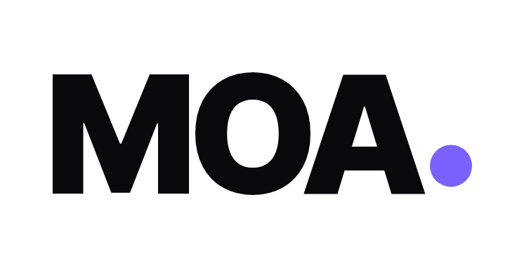
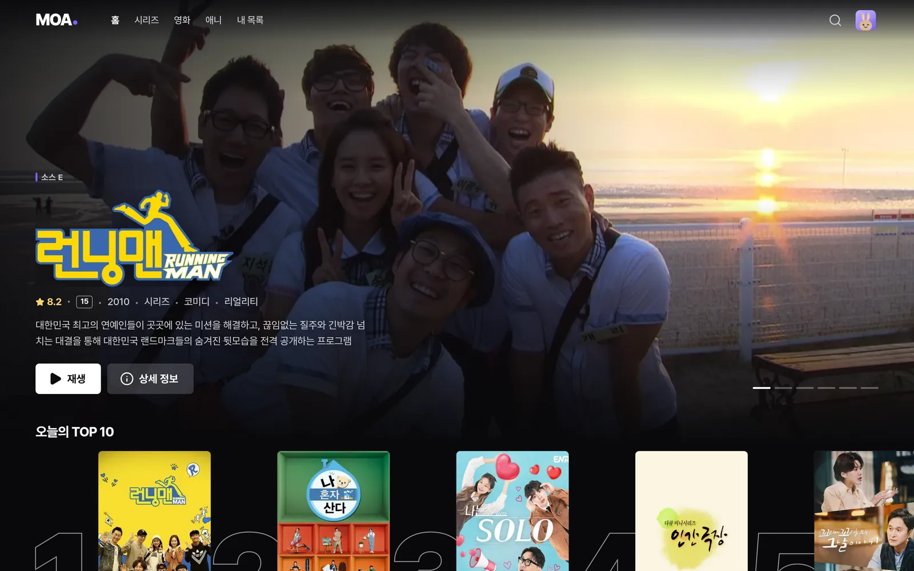
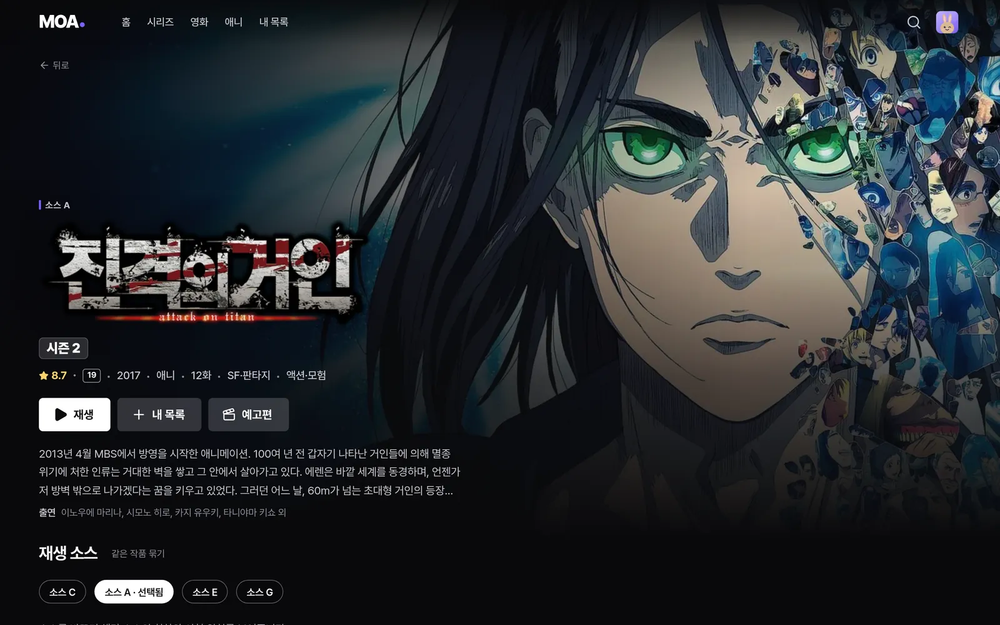
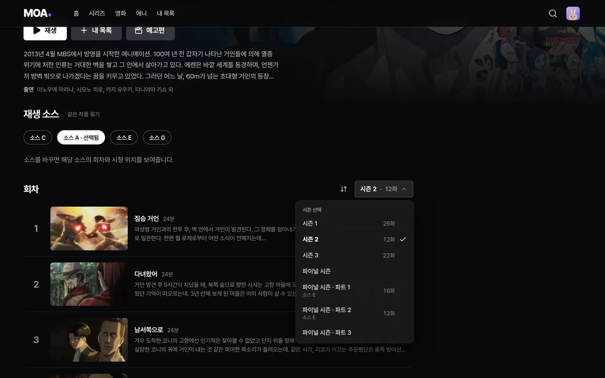
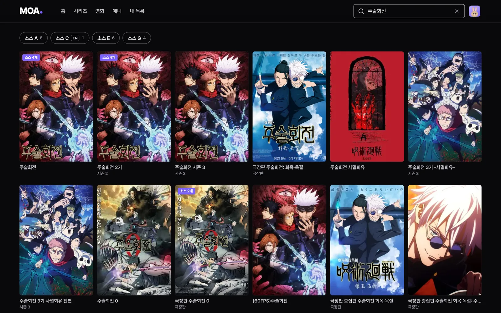
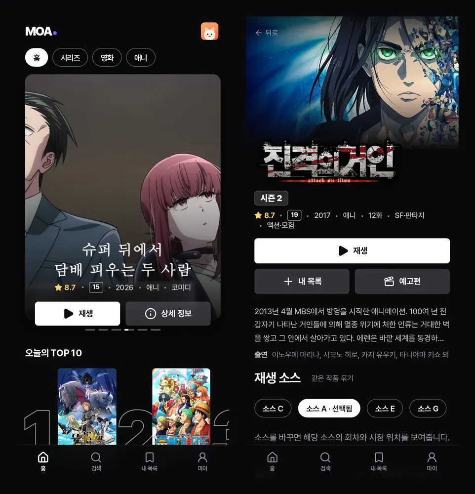

<div align="center">

<picture>
  <source media="(prefers-color-scheme: dark)" srcset=".github/assets/logo-dark.png">
  
</picture>

### 내 서버에서 돌리는 영상 전용 스트리밍 앱

여러 영상 소스와 내 라이브러리를 넷플릭스 같은 화면 하나로 모아 봅니다.

[](LICENSE)


[기능](#기능) · [빠른 시작](#빠른-시작) · [확장 소스](#확장-소스) · [문서](#문서) · [면책](#면책-disclaimer)

<br>



</div>

<br>

## 기능

|  |  |
|---|---|
| 🎬 **넷플릭스 같은 화면** | 배너, 가로 줄, TOP 10, 스켈레톤 로딩. PC·모바일·TV 화면에 맞춰 바뀝니다. |
| 🔎 **통합 검색** | 설치한 모든 소스와 내 라이브러리를 한 번에 검색하고, 같은 작품은 카드 하나로 묶습니다. |
| 📺 **시즌 전환** | 다른 소스에 흩어진 시즌을 모아 `시즌 1 · 26화 ▾` 메뉴에서 바로 전환합니다. |
| 🧩 **확장 실행기** | Mangayomi JS 확장과 Aniyomi APK 확장을 실행합니다. 저장소는 사용자가 직접 추가합니다. |
| 🗂️ **내 라이브러리** | 서버의 영상 폴더를 스캔해 같은 화면에서 재생합니다. |
| 🖼️ **TMDB 메타데이터** | 포스터, 로고, 배경, 평점, 출연진, 시즌 정보를 자동으로 붙입니다. |
| ▶️ **내장 플레이어** | 이어 보기, 다음 화 자동 재생, 오프닝 건너뛰기, ASS 자막과 한국어 자막 검색. |
| 👨‍👩‍👧 **프로필** | 가족 프로필과 키즈 프로필, 프로필별 시청 기록과 내 목록. |
| 🕹️ **TV 리모컨** | 방향키만으로 모든 화면을 조작할 수 있습니다. |
| 📱 **PWA** | 홈 화면에 앱처럼 설치해서 씁니다. |

<table>
  <tr>
    <td width="50%"></td>
    <td width="50%"></td>
  </tr>
  <tr>
    <td align="center"><sub>작품 상세 — TMDB 로고와 시즌 표시</sub></td>
    <td align="center"><sub>소스를 넘나드는 시즌 전환</sub></td>
  </tr>
  <tr>
    <td width="50%"></td>
    <td width="50%"></td>
  </tr>
  <tr>
    <td align="center"><sub>여러 소스를 한 번에 찾는 통합 검색</sub></td>
    <td align="center"><sub>모바일</sub></td>
  </tr>
</table>

## 빠른 시작

Docker Engine·Compose와 Python 3가 필요합니다. 새 설치는 다음 순서로 시작합니다.

```sh
git clone https://github.com/sidetool/moa.git
cd moa
cp .env.example .env
mkdir -p data/auth/config data/auth/sessions deploy/local
python3 deploy/auth/set-password.py  # 첫 관리자 아이디와 비밀번호를 만듭니다
```

`.env`의 `MEDIA_PATH`를 내 미디어 폴더로 바꿉니다. 작품 정보를 쓰려면 `MOA_TMDB_TOKEN` 또는 `MOA_TMDB_API_KEY`도 채웁니다. 데이터 디렉터리는 컨테이너 사용자(UID 1000)가 쓸 수 있어야 합니다.

```sh
sudo chown -R 1000:1000 data
sudo chmod 700 data/auth/config data/auth/sessions
sudo chmod 600 data/auth/config/credentials.json
docker compose config --quiet
docker compose up -d --build
```

브라우저에서 `http://localhost:8796`을 열고 위에서 만든 관리자 계정으로 로그인합니다. 설정 → 로컬 라이브러리에서 `/media/library`의 폴더를 등록하고 스캔합니다. 기본 포트는 로컬에만 열리며, 계정 헤더를 신뢰하는 앱 포트 `8795`는 외부에 노출하지 않습니다.

APK 확장은 공유 token과 읽기 권한을 준비한 뒤 `.env`를 `COMPOSE_FILE=compose.yaml:compose.aniyomi.yaml`로 바꿉니다. Cloudflare 터널은 본인 config·credentials를 준비하고 `:compose.tunnel.yaml`을 추가합니다. 두 구성은 선택 사항이며 함께 사용할 수 있습니다(Linux 구분자 기준). 원격 접속용 HTTPS·주소 설정, token 생성과 기존 설치 업그레이드는 [배포 문서](docs/DEPLOYMENT.md)를 보세요.

## 확장 소스

MOA에는 **기본 확장 저장소가 없습니다.** 설정 → 소스에서 직접 신뢰하는 저장소 주소를 추가해야 합니다.

| 형식 | 저장소 파일 | 실행 방식 |
|---|---|---|
| Mangayomi JS | `index.min.json` / `anime_index.json` | 서버 안의 격리된 JS 런타임 |
| Aniyomi APK | `index.min.json` | 별도 컨테이너의 APK 브리지 (선택) |

확장 개발이나 형식은 [확장 문서](docs/EXTENSIONS.md)를 참고하세요. 이 저장소에 특정 사이트나 확장 저장소를 추가하는 PR은 받지 않습니다.

## 문서

- [배포](docs/DEPLOYMENT.md) — Docker로 설치하기, 로그인, 외부 접속
- [구조](docs/ARCHITECTURE.md) — 서버, 웹, 확장 런타임, APK 브리지
- [개발](docs/DEVELOPMENT.md) — 로컬 실행과 테스트
- [기여 안내](CONTRIBUTING.md) · [보안 제보](SECURITY.md)

## 기술 스택

React 19 · Vite · TanStack Query · Fastify · SQLite (`node:sqlite`) · QuickJS · Docker · nginx

## 면책 (Disclaimer)

**한국어**

- MOA는 사용자가 직접 추가한 확장을 실행하는 **프로그램**입니다. 이 프로젝트는 어떤 확장, 확장 저장소, 영상 콘텐츠도 제공·호스팅·포함·추천하지 않으며, 기본으로 설정된 저장소도 없습니다.
- 어떤 저장소와 확장을 추가하고 무엇을 재생할지는 전적으로 사용자의 선택입니다. 이로 인해 생기는 저작권 등 모든 법적 책임은 사용자에게 있으며, 사용자는 자신이 사는 곳의 법을 지켜야 합니다.
- MOA는 어떤 영상 사이트, 확장 개발자, TMDB와도 관계가 없습니다.
- 이 소프트웨어는 어떠한 보증 없이 "있는 그대로" 제공되며, 개발자는 사용으로 생기는 어떤 손해에도 책임지지 않습니다.

**English**

- MOA is a **program** that runs extensions added by its users. This project does not provide, host, bundle or endorse any extension, extension repository or media content, and ships with no repository configured.
- Which repositories and extensions you add, and what you play, is entirely your choice. You are solely responsible for any legal consequences, including copyright, and for complying with the laws that apply to you.
- MOA is not affiliated with any streaming site, extension developer or TMDB.
- This software is provided "as is", without warranty of any kind. The authors are not liable for any damages arising from its use.

자세한 내용은 [DISCLAIMER.md](DISCLAIMER.md)를 보세요.

## 라이선스

[GPL-3.0](LICENSE). 포함된 서드파티 코드의 고지는 [THIRD_PARTY_NOTICES.md](THIRD_PARTY_NOTICES.md)에 있습니다.

<sub>This product uses the TMDB API but is not endorsed or certified by TMDB.</sub>
